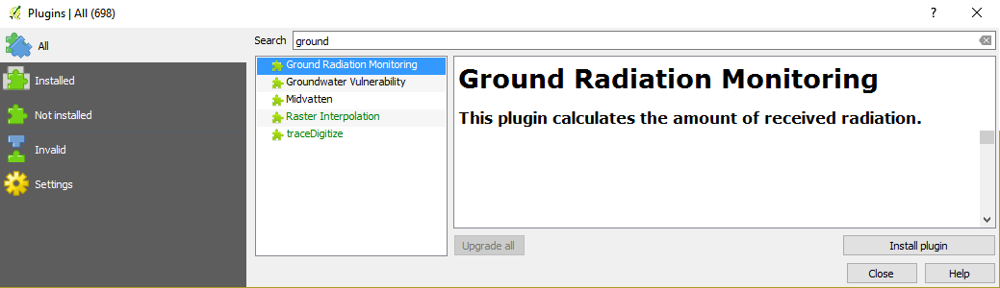
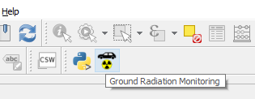

Installation
************

Best way to install new QGIS is via QGIS plugin repository.
 
Follow these instructions:
1. Go to Plugins drop down menu and select Manage and Install Plugins...:

.. figure:: images/install_plugin_dropdown.png

   Plugins menu.

2. Search for ``Ground Radiation Monitoring`` plugin on the ``All`` or 
``Not installed`` tab. After selecting the plugin, hit ``Install plugin``
button:

   Search and install the plugin.

3. The Ground Radiation Monitoring Plugin is ready to use with the icon
appearance in the QGIS toolbar:

   Ground Radiation Monitoring Plugin on the QGIS toolbar.

