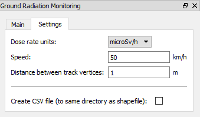
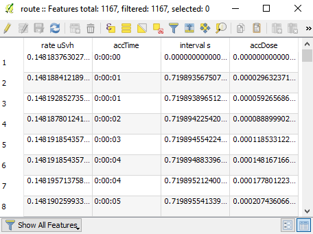

User Guide
**********

Introduction
------------

As mentioned in the general description of the plugin,
this tool helps to determine which routes are the best
and safest for mobile monitoring teams based on computed 
statistics concerning the gamma radiation dosage.

Firstly, the plugin extracts dose rate values from a given
interpolated map on vertices of a given route. Then computations 
are made, briefly it is cumulative dosage on each segment (between
two neighbor vertices) calculated from the length of the segment 
and the speed, that is given by the user. Then it is the time interval
on each segment and the cumulative time on every vertex of the route.

Also new point layer (Shapefile) is created. It contains vertices of 
the given route with data from the computation in the attribute 
table. Same data are added to CSV file, that is optionally 
created.

The most important output of the plugin is the text report file,
that contains final statistics of the route, such as length,
travel time, maximal dose rate value etc. (will be described in
next section.)

It is important to mention, that results of the computation,
especially those, that are dealing with the gamma radiation
dose, are estimates. The reason of this is, that the calculations
only use few of variables, that are dealing with this problematics. For
example it does not concern the situation on roads, weather (wind, rain..)
etc.

Sampling the track
------------------

The distance between track vertices can be very large, especially
on sections, that are straight (e.g. highways). If there is any kind 
of peak or any significant change of dose rate value on these long straight 
parts of track, it is not recognized because of the stated reason. Hence 
the plugin samples the track to smaller parts and allows user to choose the
length of them.  

GUI
---

The plugin is divided into two tabs. The first of them is ``Main`` tab:

.. figure:: images/gui_main.png

   The main tab of plugin.

* In main tab, the user may select a raster layer with the
  interpolated map of dose rate values. He may select a vector layer
  with a route. Both of those layer could be selected using combo
  boxes, which include available layers from the Layer panel. There is
  a restriction for the track combo box, that only the layer with a
  linestring type is being shown.

* Plugin also allows user to upload files with raster and vector layers
  via buttons ``Load raster`` and ``Load track``. With hitting one of these 
  buttons, a file dialog appears. Only GDAL/OGR supported files are shown.

* A tool button ``...`` that follows ``Report`` line lets the user to select 
  a destination, where the report file will be saved. Then the blank space 
  in the same line is filled with the path to selected destination file with
  *.txt* suffix. Also the blank space in the ``Shapefile`` is automatically 
  filled with the same path with a different suffix (*.shp* instead of *.txt*).

* The destination of the created shapefile could be changed with hitting
  a tool button ``...`` on ``Shapefile`` line.

* Finally, ``Save`` button does all the work, it starts the computation
  and saves created files to selected destinations.

The second tab of the plugin is ``Settings`` tab:

   The settings tab.

* This tab allows the user to change input variables. 
	
  * ``Dose rate units`` combo box sets the units of gamma radiation dose rate values
    of the interpolated map.
 
  * ``Speed`` value determines what speed the mobile team is driving. This value
    has to be given.

  * ``Distance between track vertices`` value is used for sampling the
    track. If this value is not given, the track will not be sampled.

  * ``Create CSV file`` checkbox gives the user an option, whether to
    create CSV file with the same data, that are written to created
    shapefile.

* Settings tab is filled with values by default.

Input data
----------

.. figure:: images/input.png

   Input files.

* An interpolated map of dose rate values with a format supported by 
  `GDAL library <http://www.gdal.org/formats_list.html>`__. 

* A monitoring linestring route with a format supported by `OGR library 
  <http://www.gdal.org/ogr_formats.html>`__. 

Output data
-----------

* A text report file containing fields:

  * time, when was the report created;
  
  * route information - name, monitoring speed, total monitoring time,
    total distance;

  * information about the part of the track, that has no data available 
    (where the track exceeds the raster) - time, distance;

  * estimated radiation values - maximum and average dose rate, total dose;

  * plugin settings - input raster units, distance between track vertices.

  * a static text explaining the report

.. figure:: images/report.png

   The report file.

* A shapefile with point layer containing vertices of a sampled route
  with following attributes - dose rate, cumulated time, time interval
  from previous point, cumulated dose.

   The attribute table.

* An optional CSV file with same values as in created shapefile. 

.. figure:: images/csv.png

   The CSV file.

